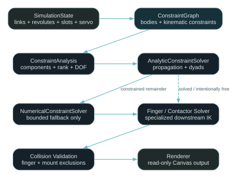
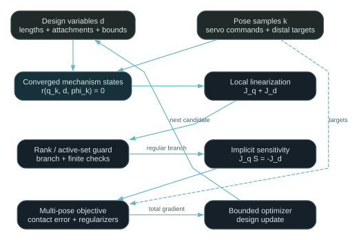

# Linkage Simulator

Linkage Simulator is a static TypeScript application for sketching and exploring planar rotational mechanisms intended to move an index finger. It combines a deterministic constraint-graph solver, a simplified left-hand radial profile, interactive component inspection, and basic mechanism editing.

The project is an engineering visualization tool, not a clinical or biomechanical model.

## Current prototype

- Builds an explicit graph from arbitrary rigid links, revolute joints, bounded linear-slot joints, fixed links, and the primary servo instead of recognizing the demonstrator by component names.
- Finds connected and disconnected mechanism components and reports anchoring, unresolved bodies, residual counts, Jacobian rank, and local mobility.
- Distinguishes passive mobility from mobility with the current absolute servo angle prescribed.
- Seeds fixed bodies and the servo-driven body, propagates locked relative angles, and reconstructs a rigid pose from any two valid local/world attachment-point pairs.
- Discovers analytically solvable dyads from topology and solves their shared joint with robust circle--circle intersection geometry.
- Preserves assembly-branch continuity by choosing the circle candidate nearest the preceding valid position of that joint, keyed by joint ID.
- Reports tangent and coincident dyads, local Jacobian rank loss, redundant constraints, structural overconstraint, and irreducible residual inconsistency separately.
- Uses a bounded damped least-squares fallback only for a still-constrained unresolved subsystem; genuine free degrees of freedom retain finite prior poses.
- Represents a pin in a finite straight slot with one normal-closure equality and explicit travel bounds. Optional Coulomb-friction data is descriptive metadata and does not alter kinematic closure.
- Computes local implicit design sensitivities from a converged full-rank residual system, including the chain-rule derivative of a scalar design objective.
- Animates a dorsally mounted servo through a 142-degree default sweep and retains independent D2--D5 workspaces.
- Carries the solved four-bar output through a locked dorsal anchor into passive middle- and distal-phalanx drivers.
- Solves the existing two-contactor finger problem downstream of the general mechanism solver, with projected joint limits and heuristic DIP coupling.
- Keeps impossible geometry finite, restores the last valid configuration after failure, and exposes compact solver diagnostics in the status area.
- Rejects unintended link--finger, ground-plane, and base-rail intersections while allowing each assigned driver--phalanx contact pair to load the digit.
- Supports selection, inspector edits, link endpoint dragging, wheel zoom, panning, radial creation/removal actions, servo/contact repositioning, and construction geometry.
- Lets a selected revolute reconnect its reference and target segments (including world/ground) while preserving the hinge's current world position, so topology edits immediately rebuild the constraint graph.
- Reports gravity-only posture-holding moments at the MCP, PIP, and DIP from size-scaled cylindrical phalanx estimates.
- Exports detached, versioned JSON snapshots for all four digit workspaces; transient solver diagnostics and analytic construction traces are not persistent configuration.

At a regular pose, the complete default mechanism graph has 18 configuration variables. Its seven revolute joints and one locked-angle equality have Jacobian rank 15, so passive mobility is 3. Prescribing the servo's absolute world angle raises the rank to 16 and leaves driven mobility 2. Those two remaining mechanical degrees of freedom are the passive middle and distal driver joints resolved by the separate finger/contact stage. The four-bar subgraph itself has mobility 1 passively and 0 with the actuator prescribed.

## Architecture

The layers are intentionally small and one-directional. Geometry and simulation contain no DOM or Canvas dependencies, and rendering never mutates mechanism state.



The implemented sensitivity primitive supports the inner linearization of the
planned multi-pose design loop; it is not itself an optimizer.



```text
src/ts/
├── geometry/    Reusable vectors, transforms, distances, and circle intersections
├── model/       Typed state, defaults, contactor constraints, and export schema
├── simulation/  Constraint graph, analysis, analytic/numerical solves, finger IK, and statics
├── rendering/   Read-only Canvas renderer and world/screen camera transform
├── ui/          Hit testing, inspector, pointer controls, radial menu, and JSON download
└── main.ts      Composition, controls, summaries, and requestAnimationFrame loop
```

The editable diagram sources are [`docs/architecture.dot`](docs/architecture.dot) and [`docs/design-optimization.dot`](docs/design-optimization.dot). The implementation-derived equations, tolerances, reference-inspired single-digit TikZ architecture, and optimization assumptions are recorded in [`manuscript/main.tex`](manuscript/main.tex).

## Local setup

Node.js 24 or newer is required by the current package configuration.

```bash
npm install
npm run dev
```

Run validation with:

```bash
npm test
npm run build
```

The production site is emitted to `dist/`. Vite uses the explicit `/LinkageSimulator/` project-site base path expected at `https://<username>.github.io/LinkageSimulator/`. The included `.github/workflows/deploy.yml` workflow builds and publishes `main`; GitHub Pages must be configured to use GitHub Actions in the repository settings.

## Controls

- **Play / Pause** sweeps or freezes the servo.
- **D2--D5 tabs** switch the visible digit workspace without changing the other digits' servo positions or edits.
- **Servo angle** directly poses the paused mechanism.
- **Hand size** scales centralized palm and phalanx dimensions.
- **Export JSON** downloads a detached, versioned snapshot containing all D2--D5 mechanisms, hands, contactors, joint-limit states, units, and moment estimates.
- **Reset** recreates the default mechanism and viewport.
- **Construction geometry** shows the current analytic dyad loci and selected intersection together with linkage construction cues.
- **Click** selects a component; click empty canvas to clear selection.
- **Drag a link's right-end handle** to seek the nearest valid primary-servo pose; an intentionally free link rotates about its attached point.
- **Right-click** opens context-sensitive creation, repositioning, and removal actions.
- **Select a contactor** to edit ring width. Its minimum follows the digit's rendered width.
- **Select a joint** to choose its reference segment (or Ground) and target segment. Self-connections are excluded and the hinge stays fixed in world space while local attachments are recomputed.
- **Select the servo** to edit its ground offset, or **select the dorsal base rail** to edit rail length and servo-relative angle.
- **Mouse wheel** zooms about the cursor; **middle-drag** or **Shift-drag** pans.

## Solver scope and limitations

- The generic graph supports planar rigid links, fixed links, revolute joints, locked revolute angles, bounded straight slots, and one prescribed rotational servo. A slot constrains only normal separation; promoting a clamped attachment to a runtime slider generally adds one mobility.
- Analytic traversal handles fixed/actuator seeds, locked-angle propagation, two-known-point reconstruction, and topology-discovered dyads. Higher-order closed loops may require the bounded numerical fallback.
- The numerical method is a local kinematic closure solve, not a global configuration search. It can fail from a poor or singular initial pose and does not cross assembly branches deliberately.
- Underconstrained and free-floating components are diagnosed and retain finite prior coordinates; the solver does not invent invisible grounding or pose constraints.
- Ordinary joint ROM is enforced as an inequality; the actuator joint instead uses the servo's authoritative absolute command bounds. The current UI does not visualize a full feasible-region map.
- The single servo must reference a revolute mounted to world or a fixed link at the configured servo ground point.
- Slot friction is author-supplied metadata only. The kinematic solver does not infer normal reactions, choose stick versus slip, or provide a material-independent PLA/ABS coefficient.
- Implicit sensitivities require a converged, finite, full-column-rank branch with an unchanged active set. Rank loss, branch switches, and newly active ROM/slot bounds are reported failure boundaries rather than silently regularized gradients.
- The two default contacts remain a specialized downstream solve rather than graph constraints. Additional arbitrary contactors do not expand that coupled solve.
- The reference-inspired one-distal-contact architecture is documented as a synthesis candidate; it has not yet replaced or been dimensionally calibrated against the default demonstrator.
- Hard geometric exclusions reject an entire candidate pose except for assigned driver--phalanx contact pairs.
- The moment readout is a quasi-static gravity estimate. It excludes linkage weight, contact forces, tendon forces, friction, compliance, and joint reactions.
- Right-end handles still search the primary servo coordinate; arbitrary joint dragging and generalized multi-DOF direct manipulation remain future work.
- Anthropometric values are broad visualization defaults, not subject-specific or clinically validated measurements.

## Roadmap

1. Calibrate a reference-derived single-digit topology and distal target path from dimensioned measurements.
2. Express its one distal contact and finger coordinates in the common residual formulation.
3. Wrap the local sensitivity API in a bounded multi-pose optimizer for link lengths, mount geometry, and clamped attachment coordinates.
4. Add a quasi-static reaction/stick--slip model before using slot-friction metadata in performance objectives.
5. Add generalized direct manipulation and multiple independently commanded actuators.
6. Add versioned JSON import and migration; versioned JSON export is implemented.

## License

See [`LICENSE`](LICENSE).
